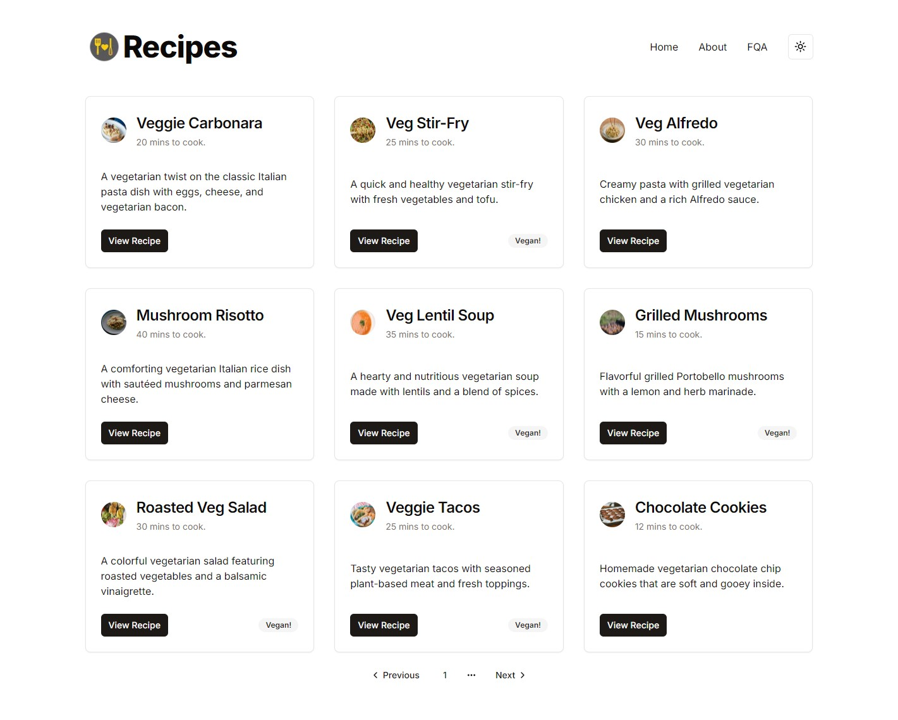

# Recipe Application



## Description

This project is a recipe application built with Next.js, Shadcn/UI for the user interface, and JSON-Server for mock
data. The primary goal is to implement and showcase the components and design system provided by Shadcn/UI.

## Table of Contents

- [Features](#features)
- [Installation](#installation)
- [Usage](#usage)
- [Technologies Used](#technologies-used)
- [Contributing](#contributing)
- [License](#license)
- [Contact](#contact)

## Features

- **Recipe Listings**: View a list of recipes with details such as ingredients and instructions.
- **Accordion Interface**: Use Shadcn/UI's accordion components to display and manage recipes in an interactive format.
- **Mock Backend**: JSON-Server serves as a mock backend for handling recipe data.

## Installation

### Prerequisites

- Node.js
- npm or Yarn

### Steps

1. **Clone the Repository**
   ```bash
   git clone https://github.com/your-username/recipe-app.git
   cd recipe-app
   ```

2. **Install Dependencies**
   ```bash
   npm install
   # or
   yarn install
   ```

3. **Run the JSON-Server**
   JSON-Server is used to serve the recipe data from a local `db.json` file.

   ```bash
   npx json-server --watch db.json --port 5000
   ```

4. **Start the Development Server**
   Start the Next.js development server.

   ```bash
   npm run dev
   # or
   yarn dev
   ```

   The application will be accessible at `http://localhost:3000`.

## Usage

- Browse recipes on the main page.
- Click on a recipe to view details using the accordion components.
- Modify the recipe data by editing the `db.json` file.

## Technologies Used

- **[Next.js](https://nextjs.org/)**: React framework for server-rendered applications.
- **[Shadcn/UI](https://ui.shadcn.com/)**: A design system providing UI components.
- **[JSON-Server](https://github.com/typicode/json-server)**: A full fake REST API for prototyping and mocking data.

## Contributing

Contributions are welcome! Please fork the repository and submit a pull request with your changes. Ensure that your code
follows the project's coding standards and includes tests if applicable.

## License

This project is licensed under the MIT License. See the [LICENSE](LICENSE) file for details.
